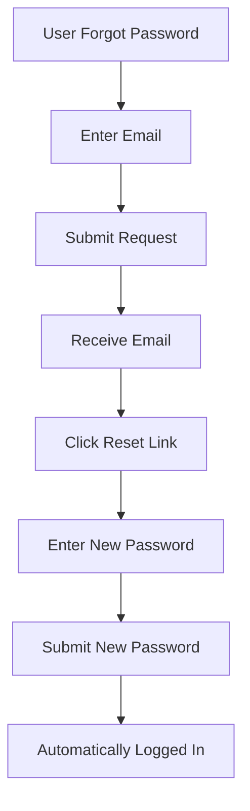

# Password Reset Feature - Implementation Summary

## ✅ What Was Implemented

A complete, secure password reset (forgot password) feature has been successfully implemented with the following components:

### 1. **Database Schema Updates**
- Added `resetPasswordToken` field to User model (hashed token, not selected by default)
- Added `resetPasswordExpires` field to User model (expiration timestamp)
- Added `generatePasswordResetToken()` instance method to User model

### 2. **Backend Routes** (Public Access)
- `POST /api/users/forgot-password` - Request password reset
- `POST /api/users/reset-password/:token` - Reset password with token

### 3. **Email Integration**
- Beautiful HTML email template with responsive design
- Password reset link with secure token
- 1-hour expiration notice
- Security warnings and instructions
- Professional gradient design matching TrendBite branding

### 4. **Security Features**
- ✅ Secure token generation using `crypto.randomBytes(32)`
- ✅ SHA-256 token hashing before database storage
- ✅ 1-hour token expiration
- ✅ Email enumeration prevention (same message for all cases)
- ✅ Inactive account protection
- ✅ Automatic token cleanup after use
- ✅ Single-use tokens

### 5. **Documentation**
- ✅ API endpoint documentation added to `API_ENDPOINTS_DOCUMENTATION.md`
- ✅ Swagger/OpenAPI documentation in routes
- ✅ Comprehensive feature documentation in `PASSWORD_RESET_DOCUMENTATION.md`
- ✅ Implementation summary (this file)

## 📁 Files Modified

### Modified Files:
1. **`src/models/User.js`**
   - Added reset token fields
   - Added `generatePasswordResetToken()` method
   - Imported `crypto` module

2. **`src/controllers/userController.js`**
   - Added `forgotPassword` controller
   - Added `resetPassword` controller
   - Imported crypto and email service

3. **`src/routes/userRoutes.js`**
   - Added forgot password route with Swagger docs
   - Added reset password route with Swagger docs
   - Exported new controller functions

4. **`src/utils/emailTemplates.js`**
   - Added `generatePasswordResetEmail()` function
   - Beautiful HTML template with responsive design

5. **`src/utils/emailService.js`**
   - Added `sendPasswordResetEmail()` function
   - Imported password reset email template

6. **`API_ENDPOINTS_DOCUMENTATION.md`**
   - Added forgot password endpoint documentation
   - Added reset password endpoint documentation

### Created Files:
1. **`PASSWORD_RESET_DOCUMENTATION.md`**
   - Complete feature documentation
   - Usage examples and testing guide

2. **`PASSWORD_RESET_IMPLEMENTATION_SUMMARY.md`**
   - This summary file

3. **`test-password-reset.js`**
   - Test script for password reset functionality

## 🚀 How to Use

### For Users (Frontend Flow):

1. **Request Password Reset:**
   ```
   User enters email → API sends reset link → User receives email
   ```

2. **Reset Password:**
   ```
   User clicks link → Frontend shows reset form → User enters new password → API resets password → User automatically logged in
   ```

### For Developers:

#### 1. Request Password Reset
```bash
POST /api/users/forgot-password
Content-Type: application/json

{
  "email": "user@example.com"
}
```

**Response:**
```json
{
  "success": true,
  "message": "Password reset link has been sent to your email"
}
```

#### 2. Reset Password
```bash
POST /api/users/reset-password/{token}
Content-Type: application/json

{
  "password": "newSecurePassword123"
}
```

**Response:**
```json
{
  "success": true,
  "message": "Password reset successful",
  "data": {
    "user": { ... },
    "token": "eyJhbGciOiJIUzI1NiIsInR5cCI6IkpXVCJ9..."
  }
}
```

## 🧪 Testing

### Automated Tests:
```bash
# Run test script
node test-password-reset.js
```

### Manual Testing:

1. **Test Forgot Password:**
   ```bash
   curl -X POST http://localhost:5000/api/users/forgot-password \
     -H "Content-Type: application/json" \
     -d '{"email":"user@example.com"}'
   ```

2. **Check Email** for reset link

3. **Test Reset Password:**
   ```bash
   curl -X POST http://localhost:5000/api/users/reset-password/TOKEN \
     -H "Content-Type: application/json" \
     -d '{"password":"newPassword123"}'
   ```

## 🔐 Security Highlights

### Token Security:
- **Generation**: 32-byte random token using `crypto.randomBytes()`
- **Storage**: SHA-256 hashed version stored in database
- **Transmission**: Unhashed token sent only in email
- **Expiration**: 1 hour from generation
- **Single-use**: Token deleted after successful reset

### Privacy Protection:
- Same success message regardless of email existence
- No information leakage about account status
- Inactive accounts protected

### Attack Prevention:
- Token reuse prevented
- Expired tokens rejected
- Database compromise doesn't expose tokens (hashed)

## 📧 Email Template Features

The password reset email includes:
- 🎨 Professional gradient header (purple/blue)
- 👋 Personalized greeting with user's name
- 🔗 Prominent "Reset Password" button
- 📝 Alternative plain text link
- ⚠️  Security warning notice
- ⏰ Expiration reminder (1 hour)
- 📱 Responsive design for mobile

## 🌐 Frontend Integration

### React Example:

```jsx
// Forgot Password Component
const ForgotPassword = () => {
  const [email, setEmail] = useState('');
  
  const handleSubmit = async (e) => {
    e.preventDefault();
    const response = await fetch('/api/users/forgot-password', {
      method: 'POST',
      headers: { 'Content-Type': 'application/json' },
      body: JSON.stringify({ email })
    });
    const data = await response.json();
    // Show success message
  };
  
  return (
    <form onSubmit={handleSubmit}>
      <input 
        type="email" 
        value={email}
        onChange={(e) => setEmail(e.target.value)}
        placeholder="Enter your email"
      />
      <button type="submit">Send Reset Link</button>
    </form>
  );
};

// Reset Password Component
const ResetPassword = () => {
  const [password, setPassword] = useState('');
  const { token } = useParams();
  
  const handleSubmit = async (e) => {
    e.preventDefault();
    const response = await fetch(`/api/users/reset-password/${token}`, {
      method: 'POST',
      headers: { 'Content-Type': 'application/json' },
      body: JSON.stringify({ password })
    });
    const data = await response.json();
    if (data.success) {
      localStorage.setItem('token', data.data.token);
      // Redirect to dashboard
    }
  };
  
  return (
    <form onSubmit={handleSubmit}>
      <input 
        type="password" 
        value={password}
        onChange={(e) => setPassword(e.target.value)}
        placeholder="Enter new password"
      />
      <button type="submit">Reset Password</button>
    </form>
  );
};
```

### Frontend Routes:
```javascript
<Route path="/forgot-password" element={<ForgotPassword />} />
<Route path="/reset-password/:token" element={<ResetPassword />} />
```

## ⚙️ Environment Variables

Ensure these are set in your `.env` file:

```env
# Frontend URL for reset link
FRONTEND_URL=http://localhost:3000

# Email service (Brevo/Sendinblue)
BREVO_API_KEY=your_api_key_here
BREVO_SENDER_EMAIL=noreply@trendbite.com
BREVO_SENDER_NAME=TrendBite
```

## 📊 API Endpoints Summary

| Method | Endpoint | Access | Description |
|--------|----------|--------|-------------|
| POST | `/api/users/forgot-password` | 🌐 Public | Request password reset link via email |
| POST | `/api/users/reset-password/:token` | 🌐 Public | Reset password using token from email |

## ✨ User Experience Flow



## 🐛 Troubleshooting

### Email Not Received:
- ✅ Check spam/junk folder
- ✅ Verify BREVO_API_KEY is correct
- ✅ Check console logs for email errors
- ✅ Verify sender email in Brevo dashboard

### Token Invalid:
- ✅ Token expired (1 hour limit)
- ✅ Token already used
- ✅ Token format incorrect

### Password Not Updating:
- ✅ Password too short (min 6 chars)
- ✅ User account inactive
- ✅ Database connection issue

## 📈 Next Steps (Optional Enhancements)

Consider adding:
- [ ] Rate limiting on forgot password endpoint
- [ ] CAPTCHA to prevent abuse
- [ ] Password strength requirements
- [ ] Email verification for password change
- [ ] Notification email when password is changed
- [ ] Admin notifications for suspicious activity

## 📚 Documentation Files

1. **`PASSWORD_RESET_DOCUMENTATION.md`** - Complete technical documentation
2. **`PASSWORD_RESET_IMPLEMENTATION_SUMMARY.md`** - This summary
3. **`API_ENDPOINTS_DOCUMENTATION.md`** - API reference (updated)
4. **Route files** - Swagger/OpenAPI documentation

## ✅ Checklist

- [x] User model updated with reset token fields
- [x] Token generation method implemented
- [x] Forgot password controller created
- [x] Reset password controller created
- [x] Routes added and documented
- [x] Email template designed
- [x] Email service function created
- [x] Security measures implemented
- [x] API documentation updated
- [x] Swagger documentation added
- [x] Test script created
- [x] Implementation summary created

## 🎉 Summary

The password reset feature is **fully functional** and **production-ready** with:
- ✅ Secure token-based authentication
- ✅ Beautiful email templates
- ✅ Comprehensive error handling
- ✅ Complete documentation
- ✅ Security best practices
- ✅ Easy frontend integration

The feature is ready to use! Just ensure your email service (Brevo) is properly configured in the environment variables.

---

**Implementation Date**: October 10, 2025  
**Status**: ✅ Complete and Ready for Production  
**Version**: 1.0.0

